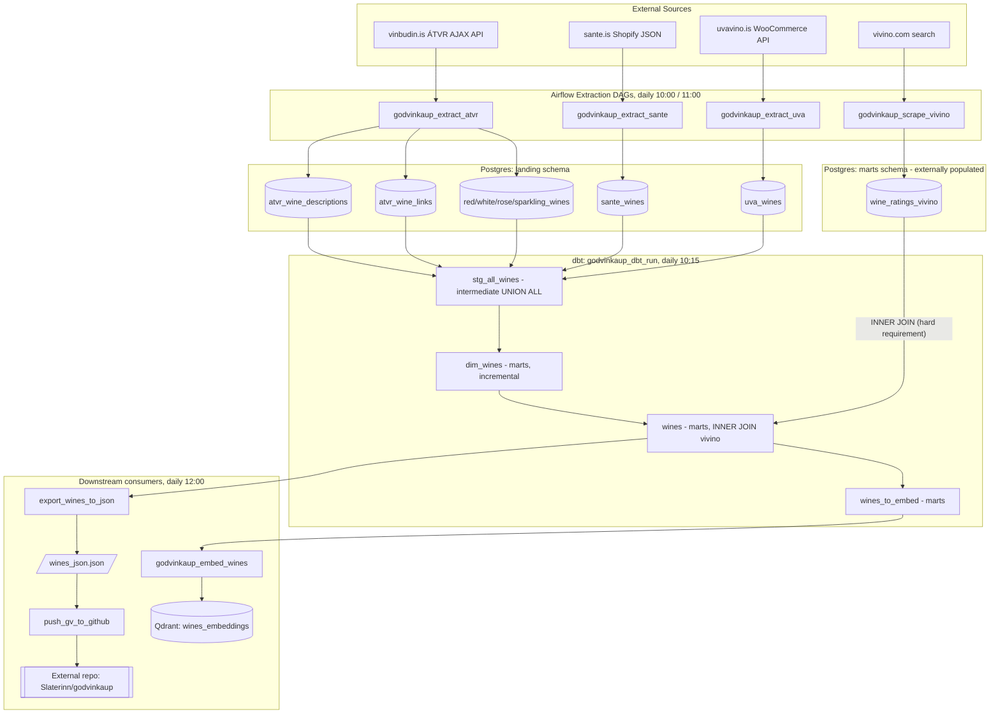

# Current ETL Architecture (Verified Discovery)

Status: read-only discovery pass. All claims below are verified against the repository at
`~/projects/godvinkaup_etl` on the `feature/wine-scoring-discovery` branch. Where something could
not be verified from code, it is listed under **Unresolved questions**.

## 1. Executive summary

Godvinkaup is a wine-recommendation ETL platform for wines sold in Iceland, orchestrated by
Airflow (`dags/`) with transformations in dbt (`godvinkaup_dbt/`), running in a Docker Compose
stack (`docker-compose.yml`, `Dockerfile`). The same Airflow/dbt/Postgres stack also runs an
unrelated fantasy-football pipeline ("Fantrax": `dags/fantrax_ingestion.py`,
`dags/scripts/fantrax/**`, `godvinkaup_dbt/models/*/fantrax/**`). This report only analyses the
wine pipeline and its Vivino dependencies; Fantrax is noted only where it shares infrastructure.

The wine pipeline scrapes four retailer/rating sources (ÁTVR/Vínbúðin, Sante, Uva Vino, Vivino),
lands raw data in a `landing` Postgres schema, unions it into a single wine table in dbt, joins it
against Vivino ratings, computes a price/quality "recommendation" score, generates OpenAI
embeddings into Qdrant, and exports a filtered JSON file that is pushed via the GitHub API to a
separate website repository (`Slaterinn/godvinkaup`, outside this repo).

**The most important architectural fact:** the mart that feeds the website and the embeddings
(`godvinkaup_dbt/models/marts/wines.sql`) performs an **inner join** against a Vivino-derived
source table (`marts.wine_ratings_vivino`). A wine with no Vivino match never reaches the website
export at all — see `docs/discovery/vivino-dependency-map.md` for the full analysis.

## 2. Repository structure (verified via `find`)

```text
dags/                        Airflow DAG definitions (10 DAGs, 2 of them stale test DAGs)
dags/scripts/                Python task bodies imported by the DAGs
dags/scripts/fantrax/        Fantrax-specific ingestion (unrelated to wine)
godvinkaup_dbt/              dbt project (profile "godvinkaup_dbt")
godvinkaup_dbt/models/staging/       dbt sources + Fantrax staging models (no wine staging models)
godvinkaup_dbt/models/intermediate/  stg_all_wines.sql, wine_food_pairings.sql, Fantrax int_* models
godvinkaup_dbt/models/marts/         dim_wines.sql, wines.sql, wines_to_embed.sql, Fantrax marts
godvinkaup_dbt/models/example/       dbt-init starter models (`my_first_dbt_model`, unused)
godvinkaup_dbt/seeds/, snapshots/, tests/, analyses/   all empty except Fantrax seeds (.gitkeep only)
scripts/                      Shell wrappers used only by the Makefile (validate/sync/deploy)
architecture/                 Empty directory
docs/                         Human docs; airflow.md/dbt.md/deployment.md/setup.md/troubleshooting.md
                               are all present but empty (0 lines of body) except docs/README.md
.github/workflows/ci.yml      Ruff format/lint + pre-commit, no tests, no dbt/Airflow validation in CI
```

## 3. Airflow DAG inventory (verified from `dags/*.py`)

| DAG ID | File | Schedule | Catchup | Tags |
|---|---|---|---|---|
| `godvinkaup_extract_atvr` | `dags/gv_scrape_atvr.py` | `0 10 * * *` | False | godvinkaup, extracts, store_atvr |
| `godvinkaup_extract_sante` | `dags/gv_scrape_sante.py` | `0 10 * * *` | False | godvinkaup, extracts, store_sante |
| `godvinkaup_extract_uva` | `dags/gv_scrape_uva.py` | `0 10 * * *` | False | godvinkaup, extracts, store_uva |
| `godvinkaup_scrape_vivino` | `dags/gv_scrape_vivino.py` | `0 11 * * *` | False | godvinkaup, vivino, ratings |
| `godvinkaup_dbt_run` | `dags/godvinkaup_dbt.py` | `15 10 * * *` | False | godvinkaup, dbt, union |
| `godvinkaup_embed_wines` | `dags/gv_embed_wines.py` | `0 12 * * *` | False | godvinkaup, embeddings |
| `export_wines_to_json` | `dags/gv_export_wines_json.py` | `0 12 * * *` | False | godvinkaup, export, git push |
| `fantrax_ingestion` | `dags/fantrax_ingestion.py` | `0 10 * * *` | False | fantrax, sports |
| `test_dbt_simple_dag` | `dags/test_dbt_simple_dag.py` | `None` (manual only) | n/a | none — references a nonexistent `example_dbt_project` path and the removed `airflow.operators.bash_operator` import path |
| `test_dbt_simple2_dag` | `dags/test_dbt_simple2_dag.py` | `timedelta(days=1)` | n/a | none — references dbt models `model1..model4` that do not exist in this project |

All DAGs use `default_args` with `retries: 1` (the two test DAGs differ: 0 and 1) and
`retry_delay: timedelta(minutes=5)`. `catchup=False` everywhere it's set explicitly.

### Deprecated/legacy Airflow patterns observed
- `airflow.utils.dates.days_ago` (deprecated in Airflow 2.x in favor of static `pendulum` dates) — used in every production wine DAG (`gv_scrape_atvr.py:5`, `gv_scrape_sante.py:5`, `gv_scrape_uva.py:5`, `gv_scrape_vivino.py:5`, `godvinkaup_dbt.py:6`, `gv_embed_wines.py:5`, `gv_export_wines_json.py:5`).
- `airflow.hooks.postgres_hook.PostgresHook` (legacy import path) is used in `scrape_atvr_descriptions.py:7`, `fix_atvr_links.py:6`, `scrape_red_wines.py:7`, `scrape_white_wines.py:7`, `scrape_rose_wines.py:7`, `scrape_sparkling_wines.py:7`, alongside the current `airflow.providers.postgres.hooks.postgres.PostgresHook` used in `scrape_uva_wines.py:5`, `export_wines_to_json.py:5` — inconsistent within the same repo.
- `airflow.operators.bash_operator.BashOperator` (legacy path) in the two stale `test_dbt_simple*_dag.py` files, vs. `airflow.operators.bash.BashOperator` used correctly in `godvinkaup_dbt.py:5`.
- `docker-compose.yml` pins `AIRFLOW__CORE__FERNET_KEY: ''` (encryption effectively disabled for connection secrets) and defaults to Airflow image `2.5.0`.

## 4. Task orchestration

- **ÁTVR** (`godvinkaup_extract_atvr`): `scrape_red_wines >> scrape_white_wines >> scrape_rose_wines >> scrape_sparkling_wines >> fix_atvr_links >> scrape_descriptions` — strictly sequential single-task-chain (`dags/gv_scrape_atvr.py:64-71`).
- **Sante** (`godvinkaup_extract_sante`): `scrape_sante_filters >> scrape_sante_wines` (`dags/gv_scrape_sante.py:36`).
- **Uva** (`godvinkaup_extract_uva`): single task, no dependencies (`dags/gv_scrape_uva.py`).
- **Vivino** (`godvinkaup_scrape_vivino`): single task (`dags/gv_scrape_vivino.py`).
- **dbt run** (`godvinkaup_dbt_run`): single `BashOperator` running `dbt run` (`dags/godvinkaup_dbt.py:61-66`). Three `PythonSensor` tasks that would wait for the ATVR/Sante/Uva DAGs to succeed same-day are **present in the file but fully commented out** (`dags/godvinkaup_dbt.py:34-59`), so **there is no enforced inter-DAG dependency** — the 10:15 dbt run relies entirely on the 10:00 extraction DAGs finishing within 15 minutes, with no verification.
- **Embeddings** (`godvinkaup_embed_wines`) and **Export** (`export_wines_to_json`) both run at `0 12 * * *` with no explicit dependency on `godvinkaup_dbt_run` finishing — again, purely schedule-time coupling (2 hours after the dbt run), not an Airflow dependency (`ExternalTaskSensor`, dataset, or trigger).
- Within `export_wines_to_json`: `export_json >> git_push` (`dags/gv_export_wines_json.py:31`), the only DAG in the wine pipeline with an explicit intra-DAG data dependency beyond a simple chain.

## 5. Database layers (verified from SQL/Python, not inferred)

| Schema.table | Created/populated by | Materialization |
|---|---|---|
| `landing.red_wines` / `white_wines` / `rose_wines` / `sparkling_wines` | `dags/scripts/scrape_{red,white,rose,sparkling}_wines.py` — `DROP TABLE ... CASCADE; CREATE UNLOGGED TABLE ...` every run | Raw scrape, fully replaced each run |
| `landing.atvr_wine_links` | `dags/scripts/fix_atvr_links.py:77-82` — `INSERT ... ON CONFLICT DO NOTHING` | Append/upsert, not dropped |
| `landing.atvr_wine_descriptions` | `dags/scripts/scrape_atvr_descriptions.py:39-49` — `INSERT ... ON CONFLICT (wine_id) DO UPDATE` | Upsert |
| `landing.sante_wines` | `dags/scripts/scrape_sante_wines.py:70-92` — dropped/recreated every run | Raw scrape, fully replaced |
| `landing.sante_wine_filters` | `dags/scripts/scrape_sante_filters.py:33-41` — dropped/recreated every run | Raw scrape, fully replaced |
| `landing.uva_wines` | `dags/scripts/scrape_uva_wines.py:101-121` — dropped/recreated every run | Raw scrape, fully replaced |
| `landing.wine_food_translations` | Declared as a dbt source (`godvinkaup_dbt/models/staging/src_landing.yml:12`) but **no script or seed in this repo creates or populates it** | Unverified — see Unresolved questions |
| `marts.wine_ratings_vivino` | `dags/scripts/scrape_vivino_ratings.py:59-78` — `INSERT ... ON CONFLICT (pk_wine) DO UPDATE`. **No `CREATE TABLE` for this table exists anywhere in the repo** | Upsert into a table whose DDL is not tracked in Git |
| `marts.dim_wines` | dbt, `godvinkaup_dbt/models/marts/dim_wines.sql` | Incremental, `unique_key='id'`, soft-expiry via `valid` flag |
| `marts.wines` | dbt, `godvinkaup_dbt/models/marts/wines.sql` | Table, rebuilt each `dbt run` |
| `marts.wines_to_embed` | dbt, `godvinkaup_dbt/models/marts/wines_to_embed.sql` | Table |

`marts.wine_ratings_vivino` and dbt-managed `marts.*` tables share one Postgres schema
(`marts`) even though only the latter are governed by dbt — ownership boundaries are blurred (see
`technical-debt-register.md`).

## 6. dbt model layers (verified via `ref()`/`source()`, not filenames)

- **Sources** (`godvinkaup_dbt/models/staging/src_landing.yml`, `godvinkaup_dbt/models/marts/schema.yml`): `landing.{red,white,rose,sparkling,sante,uva}_wines`, `landing.atvr_wine_{links,descriptions}`, `landing.wine_food_translations`, `marts.wine_ratings_vivino`.
- **"Staging" naming vs. folder layout**: there are no `models/staging/*.sql` files for wine. The union/cleaning logic that a `stg_` prefix normally implies actually lives in `godvinkaup_dbt/models/intermediate/stg_all_wines.sql` — an *intermediate*-tier model with a *staging*-style name. This is a naming/layering mismatch, not a staging layer that's missing functionality.
- **Intermediate**: `stg_all_wines.sql` — `UNION ALL` of 6 CTEs (`red_wines`, `white_wines`, `sparkling_wines`, `rose_wines`, `sante_wines`, `uva_wines`), each reading its respective `source()`, each doing its own field mapping/enum translation (taste_group Icelandic labels, container_type labels), each independently re-implementing the same `CASE` translation tables for `container_type`/`taste_group` (duplicated 4× across the ÁTVR-family CTEs, `stg_all_wines.sql:18-53`, `:80-115`, `:143-178`, `:206-241`). `wine_food_pairings.sql` joins `dim_wines` against `landing.wine_food_translations`.
- **Marts**: `dim_wines.sql` (incremental identity/expiry table over `stg_all_wines`) → `wines.sql` (inner-joins `dim_wines` to the Vivino source, left-joins `wine_food_pairings`, computes `recommendation`) → `wines_to_embed.sql` (builds an Icelandic natural-language `text_to_embed` string from `wines`, embedding Vivino rating language directly into the text).
- Only `godvinkaup_dbt/models/example/*` (dbt-init starter models `my_first_dbt_model`/`my_second_dbt_model`) exist outside this chain for the wine domain, and are unused scaffolding.

## 7. Export mechanism

1. `dags/scripts/embed_wines.py` reads `marts.wines_to_embed WHERE recommendation >= 0.5` (line 59), generates OpenAI `text-embedding-3-small` embeddings, upserts into Qdrant collection `wines_embeddings` (line 11) with a payload that includes `rating`, `rating_count`, and `link_vivino` (lines 121-125).
2. `dags/scripts/export_wines_to_json.py` reads `marts.wines WHERE rating > 3.4` (line 14), dumps the full row set to `/opt/airflow/godvinkaup_website/data/wines_json.json` (line 26) — a path that, per `docker-compose.yml:72`, is a bind mount of `/home/slaterinn/git_repos/godvinkaup` (a **separate, external Git repository**, not part of this codebase and not inspected further per task scope).
3. `dags/scripts/push_gv_to_github.py` reads that same file and pushes it via the GitHub Contents API to `Slaterinn/godvinkaup`, branch `master`, path `data/wines_json.json` (lines 10-14), using a `GITHUB_TOKEN` sourced from an environment variable or Airflow Variable (line 8) — but see `technical-debt-register.md` for a **hardcoded token literal also present in `docker-compose.yml:63`**.

## 8. Website-facing output

The only website-facing artifact traceable from this repository is `data/wines_json.json` in the
external `godvinkaup` GitHub repo, generated by the query in item 7.2 above. Its schema is exactly
the column set of `marts.wines` (via `SELECT *`), so every column documented in
`godvinkaup_dbt/models/marts/schema.yml` — including `rating`, `rating_count`, `vivino_id`,
`link_vivino`, `producer_vivino` — is exported verbatim to the website dataset.

## 9. Architecture diagram



## 10. Verified operational entry points

- `make validate` → `scripts/validate_airflow.sh` + `scripts/validate_dbt.sh`, both of which `docker compose exec` into the **runtime repository** (`~/docker/dbt-airflow` by default, overridable via `$RUNTIME_DIR`) — i.e. validation runs against the deployed runtime, not this development repo directly.
- `make sync-runtime` / `make deploy` → `scripts/sync_runtime.sh` / `scripts/deploy_to_runtime.sh`, which `git pull` the runtime repo and re-run validation. **Not executed during this discovery task**, per the working rules.
- `.github/workflows/ci.yml` runs Ruff format/lint and pre-commit only — no dbt or Airflow validation runs in CI.

## 11. Unresolved questions

1. Is `landing.wine_food_translations` populated by a process outside this repository (manual load, another tool), or is it dead/aspirational? No creator was found in `dags/`, `scripts/`, or `godvinkaup_dbt/seeds/`.
2. What is the actual DDL/schema of `marts.wine_ratings_vivino`? It is only ever referenced via `INSERT ... ON CONFLICT`, implying the table (and its `ON CONFLICT` unique constraint on `pk_wine`) must pre-exist in the database, but no DDL is tracked in Git.
3. Is the runtime repository (`~/docker/dbt-airflow`) currently in sync with this development repository? Not checked, per instruction not to touch the runtime repo.
4. What actual retention/refresh cadence does `marts.wine_ratings_vivino` follow given the scraper is `LIMIT 15` per run (`scrape_vivino_ratings.py:211`) — at that rate, matching the full wine catalog could take a long time; the effective backlog size was not measurable from this repo alone (would require live DB access, out of scope).
5. Whether `docker-compose.yml`'s `postgres`/`redis` services are the same database the scrapers write to — they are not: the scrapers connect to `192.168.86.226:5433` (a separate/external Postgres host), while `docker-compose.yml`'s bundled `postgres` service is Airflow's own metadata DB. This should be confirmed with whoever owns the `192.168.86.226` host.
